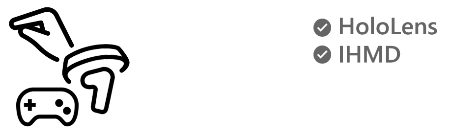
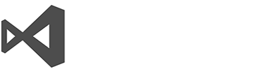
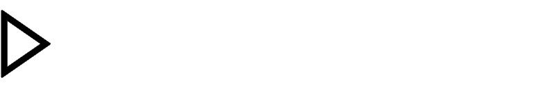
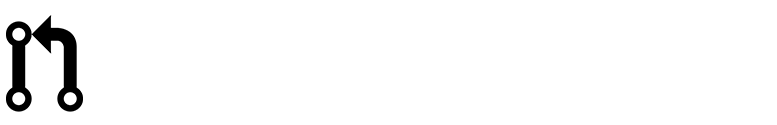

## Hololens MR Starter

A simple project for getting started with the hololens including the Uniy pugin for the HoloToolKit by Microsoft.

> ## HoloLens Developers
> Currently we are waiting on a fix for HoloLens development from Unity, for now you should use the 2017.1.2 version of Unity and the "Release" version of the MRTK Asset:
>
> [![Github Release][mrtk-version-badge]][githubhl-rel]
>
> [![Github Release][githubhl-rel-badge]][unity-release]
>
> ### For existing HoloLens developers, also check out the [Breaking Changes](/BreakingChanges.md) information from the previous release.

Looking to upgrade your projects to Windows Mixed Reality? [Follow the Upgrade Guide](/UpgradeGuide.md).

# Feature areas
The Mixed Reality Toolkit for Unity includes many API's to accelerate the development of Mixed Reality projects for both HoloLens and the newer Immersive Headsets (IHMD)

|   [Input](Assets/HoloToolkit/Input/README.md)                                               |  [Sharing](Assets/HoloToolkit/Sharing/README.md)   |  [Spatial Mapping](Assets/HoloToolkit/SpatialMapping/README.md)| 
| :--- | :--- | :--- |
| Scripts that leverage inputs such as gaze, gesture, voice and motion controllers. | Sharing library enables collaboration across multiple devices. | Scripts that allow applications to bring the real world into the digital using HoloLens. | 
|  [Spatial Sound](Assets/HoloToolkit/SpatialSound/README.md) |  [UX Controls](Assets/HoloToolkit/UX/README.md)|  [Utilities](Assets/HoloToolkit/Utilities/README.md) | 
| Scripts to help plug spatial audio into your application. | Building blocks for creating good UX in your application like common controls. | Common helpers and tools that you can leverage in your application. |
|  [Spatial Understanding](Assets/HoloToolkit/SpatialUnderstanding/README.md)|  [Build](Assets/HoloToolkit/BuildAndDeploy/README.md)|  [Boundary](Assets/HoloToolkit/Boundary/README.md)                       |
| Tailor experiences based on room semantics like couch, wall etc.                                                                                  | Build and deploy automation window for Unity Editor.                                                        | Scripts that help with rendering the floor and boundaries for Immersive Devices.

# Required Software
|  [Windows 10 FCU](https://www.microsoft.com/software-download/windows10)|  [Unity 3D](https://unity3d.com/get-unity/download/archive)|  [Visual Studio 2017](http://dev.windows.com/downloads)|  [Simulator (optional)](https://go.microsoft.com/fwlink/?linkid=852626)|
| :--- | :--- | :--- | :--- |
| To develop apps for mixed reality headsets, you need the Windows 10 Fall Creators Update | The Unity 3D engine provides support for building mixed reality projects in Windows 10 | Visual Studio is used for code editing, deploying and building UWP app packages | The Emulators allow you test your app without the device in a simulated environment |

# Getting started with MRTK
To get up and going as quickly as possible, here are some guides to help you get started building Mixed Reality Projects

|  [Quick start](GettingStarted.md) |  [Contributing to this project](CONTRIBUTING.md) |  [Fall Creators Update](FallCreatorsUpdate.md) |
|:--- | :--- | :--- |
| Please go over the [Getting started guide](GettingStarted.md) to learn more about getting off the ground quickly. | Please go over the [Contributing guidelines](CONTRIBUTING.md) to learn more about the process and thinking. | Check out the recent updates for Windows Mixed reality in the [Fall Creators update](/FallCreatorsUpdate.md) |

## Getting started

You don't need a hololens to get started. You can get the emulator, pull the project and build for the hololens, you can find the information you need right here:
https://www.microsoft.com/microsoft-hololens/en-us/developers

## License

Copyright 2017 Daniel Blair

Permission is hereby granted, free of charge, to any person obtaining a copy of this software and associated documentation files (the "Software"), to deal in the Software without restriction, including without limitation the rights to use, copy, modify, merge, publish, distribute, sublicense, and/or sell copies of the Software, and to permit persons to whom the Software is furnished to do so, subject to the following conditions:

The above copyright notice and this permission notice shall be included in all copies or substantial portions of the Software.

THE SOFTWARE IS PROVIDED "AS IS", WITHOUT WARRANTY OF ANY KIND, EXPRESS OR IMPLIED, INCLUDING BUT NOT LIMITED TO THE WARRANTIES OF MERCHANTABILITY, FITNESS FOR A PARTICULAR PURPOSE AND NONINFRINGEMENT. IN NO EVENT SHALL THE AUTHORS OR COPYRIGHT HOLDERS BE LIABLE FOR ANY CLAIM, DAMAGES OR OTHER LIABILITY, WHETHER IN AN ACTION OF CONTRACT, TORT OR OTHERWISE, ARISING FROM, OUT OF OR IN CONNECTION WITH THE SOFTWARE OR THE USE OR OTHER DEALINGS IN THE SOFTWARE.