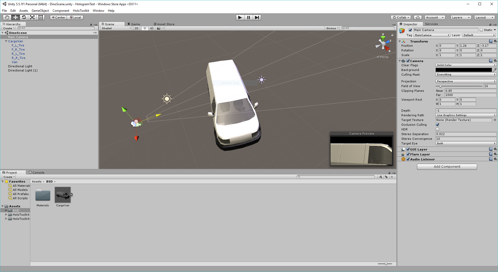

# Hololens Starter

A simple project for getting started with the hololens including the Uniy pugin for the HoloToolKit by Microsoft.

## HoloToolkit-Unity
This is effectively part of the existing HoloToolkit, but this is the repository that will contain all Unity specific components.
The HoloToolkit is a collection of scripts and components intended to accelerate development of holographic applications targeting Windows Holographic.

**Current Unity Editor Project Version: 5.5.1f1**

HoloToolkit contains the following feature areas:

1. [Input](Assets/HoloToolkit/Input/README.md)
2. [Sharing](Assets/HoloToolkit/Sharing/README.md)
3. [Spatial Mapping](Assets/HoloToolkit/SpatialMapping/README.md)
4. [Spatial Understanding](Assets/HoloToolkit/SpatialUnderstanding/README.md)
5. [Spatial Sound](Assets/HoloToolkit/SpatialSound/README.md)
6. [Utilities](Assets/HoloToolkit/Utilities/README.md)
7. [Build](Assets/HoloToolkit/Build/README.md)

To learn more about individual HoloLens feature areas, please read the [Wiki](https://github.com/Microsoft/HoloToolkit-Unity/wiki) section.

To learn how to add the HoloToolkit to your project see the [Getting Started](GettingStarted.md) guide.

This project has adopted the [Microsoft Open Source Code of Conduct](https://opensource.microsoft.com/codeofconduct/). 
For more information see the [Code of Conduct FAQ](https://opensource.microsoft.com/codeofconduct/faq/) or contact [opencode@microsoft.com](mailto:opencode@microsoft.com) with any additional questions or comments.

## Getting started

You don't need a hololens to get started. You can get the emulator, pull the project and build for the hololens, you can find the information you need right here:
https://www.microsoft.com/microsoft-hololens/en-us/developers

## License

Copyright 2017 Daniel Blair

Permission is hereby granted, free of charge, to any person obtaining a copy of this software and associated documentation files (the "Software"), to deal in the Software without restriction, including without limitation the rights to use, copy, modify, merge, publish, distribute, sublicense, and/or sell copies of the Software, and to permit persons to whom the Software is furnished to do so, subject to the following conditions:

The above copyright notice and this permission notice shall be included in all copies or substantial portions of the Software.

THE SOFTWARE IS PROVIDED "AS IS", WITHOUT WARRANTY OF ANY KIND, EXPRESS OR IMPLIED, INCLUDING BUT NOT LIMITED TO THE WARRANTIES OF MERCHANTABILITY, FITNESS FOR A PARTICULAR PURPOSE AND NONINFRINGEMENT. IN NO EVENT SHALL THE AUTHORS OR COPYRIGHT HOLDERS BE LIABLE FOR ANY CLAIM, DAMAGES OR OTHER LIABILITY, WHETHER IN AN ACTION OF CONTRACT, TORT OR OTHERWISE, ARISING FROM, OUT OF OR IN CONNECTION WITH THE SOFTWARE OR THE USE OR OTHER DEALINGS IN THE SOFTWARE.